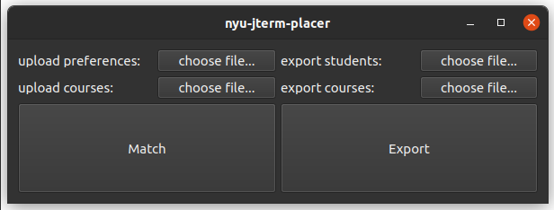

# NYU J-Term Placer Tool &nbsp;  

## Introduction

In NYU J-Terms are short 3 week intensive courses that can be abroad, on campus, or with an international trip.

Since jterm courses have very limited capacities, applying to jterms is different from applying to normal courses. Students pick their top 6 choices in order and the system should try to place them in the best possible way, given that:
- Each course has a certain maximum capacity
- Students that will graduate earlier are given priority (i.e. seniors, then sophomores, etc.)
- The system tries to maximize the total happiness

However after the last jterm placement, this project is a proposal for a better jterm placer algorithm!

## Instructions

## How it works

This algorithm uses a modified version of weighted MCBM (Maximum Cardinality Bipartite Matching) to do the placing in the maximum possible happiness. The graph is modelled such that students are nodes on one side, courses are nodes on the other side and choices are weighted edges connecting a student and a course. The weights are chosen so that the higher the choice is up the students choice list the lower the weight and the algorithm finds the minimum matching, and therefore producing the maximum happiness.

## Code in Action!

This is a sample run with 5 students and 3 courses.

> In this visualisation, the graph on the left is the initial graph of choices and the one on the right is the resulting graph of placements.
> The heavier the edge is the higher the choice is up the student choice list, and the heavier the node border is the higher the priority the student has (seniors, then sophomores, etc.).
> The dashed edges are of cost zero and have their capacities labelled on them.

## Algorithmic Details

The weighted MCBM is solved by modelling the problem as a flow graph with costs and getting the MCMF (Minimum Cost Maximum Flow), using a modified version of Edmonds-Karp algorithm, where we substitute the bfs with Bellman-Ford-Moore's algorithm in order to calculate the augmenting path of least cost. Notice that we don't use Dijkstra's algorithm as negative costs are possible.

First notice that each edge has two values, the cost (weight) and the capacity. The cost is the amount it contributes to the total happiness score and the capacity is the amount of flow (the number of students) that can go through this edge.

In order to allow for courses to have limited maximum capacity, the course nodes are split into two nodes in the graph with an edge with a capacity equal to the capacity of the course connecting them, so the maximum flow between the two nodes is limited, however the cost (weight) of using that edge is zero as it shouldn't change the total happiness.

If the weights of the choices are given as a linear sequence, like (0, 1, 2, 3, 4, 5, ...) then if there are 2 students, S1 and S2 and the algorithm can either place S1 in first choice and S2 in fifth choice, or place both in their third choice, both would be equally like as they have the same total score 0 + 4 = 2 + 2 = 4. However, for the sake of fairness we would like the algorithm in this case to place both in their third choice, so the latter placing should be of lower score. 

In order to fix this problem the weights will be chosen as a quadratic sequence (i.e. 0, 1, 4, 9, 16, 25), so that two third choices are more desirable than a first and a fifth choice, (4 + 4 = 8) < (0 + 9 = 9), which achieves the desired behaviour.

Since upperclassmen are given the priority, the weights of their choices should go up more quickly compared to younger students so that it would increase the score more (decrease the happiness) to place an upperclassman student in a lower choice compared to placing a younger student in a lower choice. In order to do so, we can multiply the weights of the choices by the year of the student, that way the weights are given as:

- Freshmen   : 0, 1, 4,  9,  16, 25
- Sophomores : 0, 2, 8,  18, 32, 50
- Juniors    : 0, 3, 12, 27, 48, 75
- Seniors    : 0, 4, 16, 36, 64, 100

That way we can achieve the effect of giving upperclassmen priority.

#### Time Complexity Analysis

This algorithm will work in O(S * ((S + C) * S)) = O(S3 + S2C) where S is the number of students and C is the number of courses. This is because each run of the bellman-ford-moore algorithm takes O(VE), and it will be ran O(total\_flow) times, and V = O(S + C), and E = O(S * N), where N is the number of choices each student makes.

Given this time complexity, I'd expect the code to run in a few (1-3) seconds for a school like NYUAD with 2000 students and under 100 jterm course options.

## Graphical User Interface

As the final step of the project, using Qt, we implemented a user interface to help the user/university upload the list of courses, the list of students and their details and choices. The "Match" button lets the program match the students and the "Export" option lets you save the details to a spreadsheet of the user's choice.

